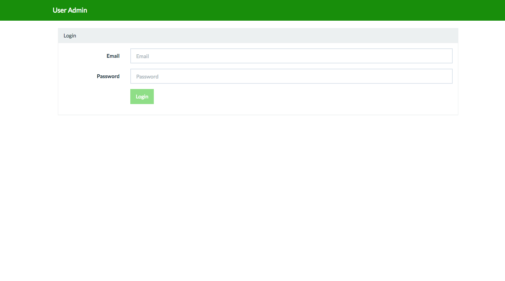
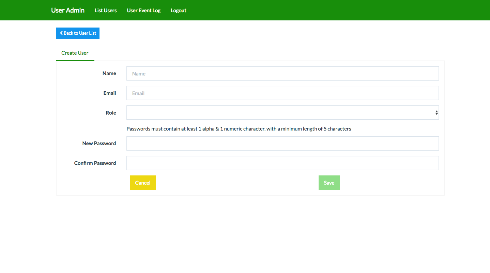

# Angular GUI

## Welcome to the Angular GUI!

If you are able to see the page in the screenshot below then ..congratulations! 
The hardest part is now over. 

Now, let's get started!

## Log-In

At the very start of the app, you should see the Email and Password form.

You can use the following credentials to start the log-in process.

User:

    erdiko@arroyolabs.com

Password:

    password

Assuming everything goes well, you should be brought into the home page and a message that tells you that the Login is Successful.
Lets click on **Create User** below the Erdiko User Admin header title to create our first User.

## Create User

When Create a User is clicked from the home page, you will be directed to the following page:

The User information requires a name, valid email address, a role (Admin, User, etc) as well as a password that requires at least a numeric character and at least 5 characters.

Let's create a User name created at random ...say Cody Bellinger.

When valid name, email address and password is used, a new user will be created.

## User List

When User List is clicked from either the navigation bar or the content. Below is the list of names containing the names generated from our database. 
(If you have jumped in straight to the User List without creating a user, the list will be empty).
The user list will be generated as soon as you start creating users! (Cody Bellinger is available at top of the list from our previous examplef).

## Users-Event-Log

Erdiko's User Admin package collects significant histories of action taken by each user. When **User Event Log** is clicked, a brief overview of every action every user has made is generated.

## Edit / Update User Information

If/When you decide that the user information is outdated and needs to be changed, click on the **Edit** link in the Row of a user you would like changed.
In the Edit-User Page's **Edit User** tab, all the User information is available for change. In the Edit-User page, value of name, email and user's role which are initially given in the Create User section can be changed.
When all the editable information are valid, the **Save** button will be enabled. 

Cody Bellinger's name and email will be replaced by Clark Kent and his email address. (Notice how the User ID, Joined Date as well as Last Login is same as before).

Cody Bellinger is now Clark Kent!

You can go back to the User-List to confirm the change.

## Edit / Update User Password

Just like changing the User Information, User Password can also be changed with ease.

Click on the **Update Password** tab next to the **Edit User** tab to create a new password. Just like as in **Create User**, the new password also requires at least a numeric character and at least 5 characters. 

Password being changed is shown below:

## User-Event Log

Below the Edit User form is an User Event Log. This table generates the grid listing all the actions taken by this specified user. Because this user has not taken any action thus far, none is generated.

## Delete User

If the User happenned to be created by a mistake, the red **Delete** button is available at the last column of the **User List**. Please click the Delete button of the User's Row you want deleted.

It will prompt you one last time to ensure this is the action you would want to take.

After confirming the action, quick glance at the top of User List will verify that Clark Kent is no more.

## Log-Out 

If everything is well finished, click the **Logout** link in the Navigation Bar to logout.
